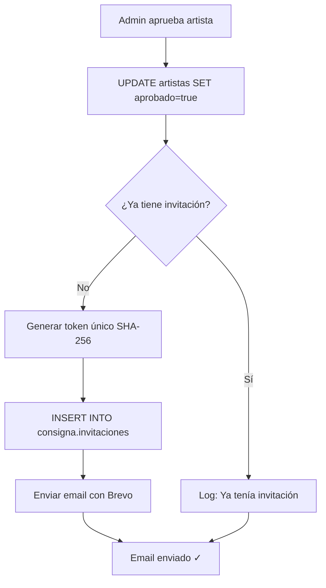
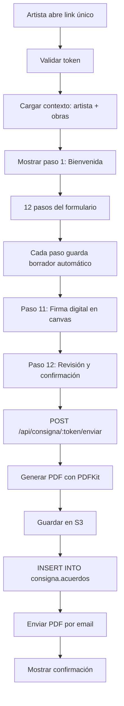
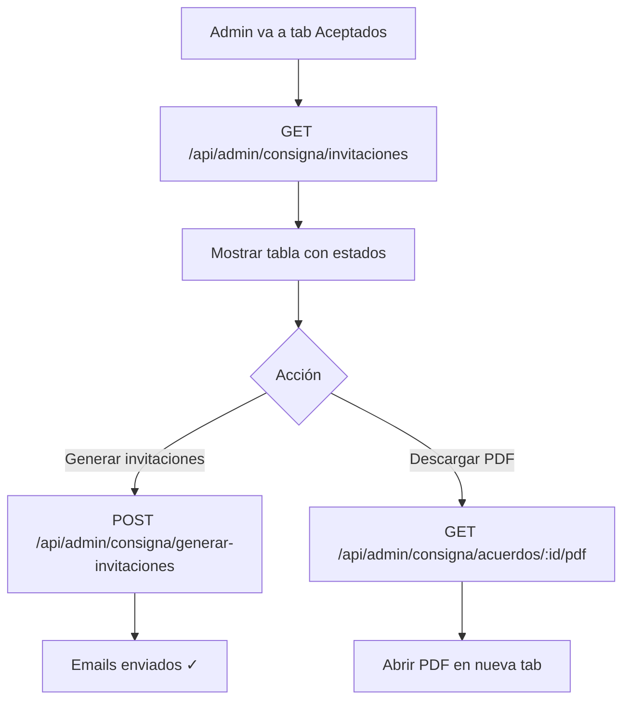

# Sistema de Hojas de Consignación

## 📋 Tabla de Contenidos

- [Descripción General](#descripción-general)
- [Arquitectura](#arquitectura)
- [Instalación y Configuración](#instalación-y-configuración)
- [Flujos de Usuario](#flujos-de-usuario)
- [API Reference](#api-reference)
- [Frontend](#frontend)
- [Base de Datos](#base-de-datos)
- [Seguridad](#seguridad)
- [Testing](#testing)
- [Troubleshooting](#troubleshooting)

---

## Descripción General

Sistema integral para la gestión de hojas de consignación de obras de arte en ARTE FACTO. Permite a los artistas aprobados completar digitalmente su acuerdo de consignación con firma electrónica y generación automática de PDFs.

### Características Principales

- ✅ **Invitaciones Automáticas**: Envío de emails con links únicos al aprobar artistas
- ✅ **Formulario Multi-paso**: 12 pasos con validación y guardado automático
- ✅ **Firma Digital**: Canvas HTML5 para firma electrónica
- ✅ **Generación de PDFs**: Documentos profesionales con PDFKit
- ✅ **Gestión de Precios**: Cálculo automático de comisiones (75/25)
- ✅ **Panel de Admin**: Dashboard completo para gestionar invitaciones y acuerdos
- ✅ **Emails con Brevo**: Templates profesionales con adjuntos
- ✅ **Storage en S3**: Almacenamiento seguro de PDFs y constancias fiscales

---

## Arquitectura

### Stack Tecnológico

**Backend:**
- Express.js 4.x
- PostgreSQL 14+
- AWS S3 SDK v3
- PDFKit
- Brevo API (emails)
- Node.js 18+

**Frontend:**
- Next.js 14 (App Router)
- React 18
- Tailwind CSS
- Lucide Icons
- Fetch API

### Principios de Diseño

- **SOLID**: Separación de responsabilidades, inversión de dependencias
- **Dependency Injection**: Contenedor central para todas las dependencias
- **Separation of Concerns**: Capas claramente definidas (domain, infra, services, http)
- **Security by Design**: Tokens hashed, rate limiting, validación exhaustiva

### Estructura del Proyecto

```
/backend/src/
├── config/migrations/consigna/     # Migraciones SQL
│   ├── 000_roles.sql
│   ├── 001_esquema_consigna.sql
│   └── 002_vistas_lectura.sql
│
├── consigna/                       # Módulo principal
│   ├── config/                     # Configuración
│   ├── domain/                     # Lógica de negocio
│   ├── infra/                      # Servicios externos
│   ├── repositories/               # Capa de datos
│   ├── services/                   # Servicios de dominio
│   ├── http/                       # Controladores REST
│   ├── pdf/                        # Generación de PDFs
│   ├── shared/                     # Código compartido
│   ├── scripts/                    # CLIs
│   └── contenedor.js               # DI container
│
├── routes/consigna.routes.js       # Rutas de admin
├── controllers/artistas.controller.js  # Modificado para emails
└── server.js                       # Integración principal

/frontend/
├── app/consigna/                   # Rutas públicas
│   ├── [token]/page.js
│   └── layout.js
│
├── features/consigna/              # Feature module
│   ├── components/                 # 20 componentes React
│   ├── hooks/                      # 3 hooks personalizados
│   ├── api/                        # Cliente HTTP
│   ├── estado/                     # Reducer + estado
│   ├── shared/                     # Código compartido
│   ├── ConsignaPage.jsx
│   └── tema.js
│
└── components/admin/
    ├── ArtistasAceptados.jsx       # Panel de gestión
    └── ArtistasTable.jsx           # Modificado para integrar panel
```

---

## Instalación y Configuración

### 1. Requisitos Previos

- Node.js >= 18
- PostgreSQL >= 14
- Cuenta de AWS con S3 configurado
- Cuenta de Brevo (para emails)

### 2. Variables de Entorno

Agregar al archivo `/backend/.env`:

```bash
# Sistema de Consigna
PUBLIC_APP_URL=https://arte-facto.mx/consigna
INVITACION_DIAS_VIGENCIA=4
EDICION_SUFIJO=AF2

# Datos de Pago
PAGO_BENEFICIARIO="ARTE FACTO S.A. de C.V."
PAGO_BANCO="BBVA"
PAGO_CLABE="012345678901234567"
PAGO_CUENTA="0123456789"
PAGO_PLAZOS="Feria: 15 días o 10 mar 2027; Post-evento: 15 días (hasta 6 meses)"

# Contacto
CONTACTO_WHATSAPP="+5215578363207"
CONTACTO_URL="https://arte-facto.mx/#contacto"

# AWS S3
S3_CONSIGNA_BUCKET=artefacto-consigna-privado
S3_CONSIGNA_PREFIX=af2/
FIRMA_DIRECCION_KEY=assets/firma-direccion.png

# Emails Admin
ADMIN_EMAILS=admin@arte-facto.mx,curatorial@arte-facto.mx

# Brevo Templates (IDs se obtienen del dashboard de Brevo)
BREVO_TEMPLATE_CONSIGNA_INVITACION=4
BREVO_TEMPLATE_CONSIGNA_RECHAZO=5
BREVO_TEMPLATE_CONSIGNA_ACUERDO=6
```

### 3. Ejecutar Migraciones

```bash
# Conectarse a la base de datos
psql -U postgres -d artefacto

# Ejecutar migraciones
node -e "import('./src/config/migrations/runConsignaMigrations.js').then(m => m.runConsignaMigrations())"
```

Esto creará:
- Rol `consigna_app` (aislado, sin acceso a `public.*`)
- Esquema `consigna` con 4 tablas
- 2 vistas de lectura (`v_artistas_seleccionados`, `v_obras_postuladas`)

### 4. Configurar S3

```bash
# Crear bucket privado
aws s3 mb s3://artefacto-consigna-privado --region us-east-1

# Configurar política de bucket (solo acceso con IAM)
aws s3api put-bucket-policy --bucket artefacto-consigna-privado --policy '{
  "Version": "2012-10-17",
  "Statement": [{
    "Effect": "Deny",
    "Principal": "*",
    "Action": "s3:*",
    "Resource": ["arn:aws:s3:::artefacto-consigna-privado", "arn:aws:s3:::artefacto-consigna-privado/*"],
    "Condition": {"Bool": {"aws:SecureTransport": "false"}}
  }]
}'

# Subir imagen de firma de la dirección
aws s3 cp firma-direccion.png s3://artefacto-consigna-privado/assets/firma-direccion.png
```

### 5. Configurar Templates en Brevo

1. Ir a https://app.brevo.com/campaign/template/create
2. Crear 3 templates:

**Template 1: CONSIGNA_INVITACION** (ID: 4)
```
Asunto: ¡Tu obra fue aceptada! Completa tu hoja de consignación - ARTE FACTO {{ params.EDICION }}

Hola {{ params.NOMBRE }},

¡Felicidades! Tu obra ha sido seleccionada para ARTE FACTO {{ params.EDICION }}.

Para confirmar tu participación, completa tu hoja de consignación aquí:
{{ params.LINK_CONSIGNA }}

Tienes {{ params.DIAS_VIGENCIA }} días para completarla.

Tu folio: {{ params.FOLIO }}

Saludos,
Equipo ARTE FACTO
```

**Template 2: CONSIGNA_RECHAZO** (ID: 5)
```
Asunto: Resultado de postulación - ARTE FACTO {{ params.EDICION }}

Hola {{ params.NOMBRE }},

Gracias por postularte a ARTE FACTO {{ params.EDICION }}.

Lamentamos informarte que en esta ocasión tu obra no fue seleccionada.
Te invitamos a participar en futuras convocatorias.

Saludos,
Equipo ARTE FACTO
```

**Template 3: CONSIGNA_ACUERDO** (ID: 6)
```
Asunto: Tu acuerdo de consignación - ARTE FACTO {{ params.EDICION }}

Hola {{ params.NOMBRE }},

Adjuntamos tu acuerdo de consignación firmado.

Recuerda realizar el pago del 50% de tu paquete en las próximas 24 horas:
- Concepto: {{ params.CONCEPTO_PAGO }}
- CLABE: {{ params.CLABE }}

¡Nos vemos en la feria!

Equipo ARTE FACTO
```

3. Copiar los IDs y agregarlos a `.env`

### 6. Instalar Dependencias

```bash
cd backend
npm install @aws-sdk/client-s3 @aws-sdk/s3-request-presigner pdfkit

cd ../frontend
npm install
```

### 7. Iniciar Servidores

```bash
# Backend
cd backend && npm run dev

# Frontend
cd frontend && npm run dev
```

---

## Flujos de Usuario

### Flujo 1: Aprobación de Artista (Automático)



**Código relevante:**
- `/backend/src/controllers/artistas.controller.js` líneas 1007-1037

### Flujo 2: Artista Completa Hoja de Consignación



**Componentes principales:**
- `/frontend/features/consigna/ConsignaPage.jsx`
- `/frontend/features/consigna/components/pasos/*`

### Flujo 3: Admin Gestiona Invitaciones



**Componente principal:**
- `/frontend/components/admin/ArtistasAceptados.jsx`

---

## API Reference

### Rutas Públicas

#### `GET /api/consigna/:token/contexto`

Obtiene el contexto inicial para un token válido.

**Headers:**
```
Content-Type: application/json
```

**Response:**
```json
{
  "success": true,
  "data": {
    "artista": {
      "id": "123",
      "nombre": "Juan Pérez",
      "nombrePila": "Juan",
      "correo": "juan@example.com",
      "rfc": "PEXJ850101XXX",
      "folio": "AF2-123",
      "telefono": "+525512345678"
    },
    "obras": [
      {
        "id": "456",
        "titulo": "Obra de ejemplo",
        "tecnica": "Óleo sobre tela",
        "medida": "100 × 80 cm",
        "gananciaRegistrada": 5000
      }
    ],
    "borrador": null,
    "versionAcuerdo": "2024-v1",
    "datosPago": {
      "beneficiario": "ARTE FACTO S.A. de C.V.",
      "banco": "BBVA",
      "clabe": "012345678901234567",
      "cuenta": "0123456789",
      "concepto": "PAQUETE JUAN PEREZ AF2",
      "plazos": "Feria: 15 días..."
    },
    "contacto": {
      "whatsapp": "+525512345678",
      "url": "https://arte-facto.mx/#contacto"
    },
    "enviado": null
  }
}
```

**Errores:**
- `404 NO_ENCONTRADO`: Token inválido
- `410 EXPIRADO`: Token expirado
- `429`: Rate limit excedido (60 req/min)

---

#### `POST /api/consigna/:token/borrador`

Guarda el progreso parcial del formulario.

**Body:**
```json
{
  "datos": {
    "pasoActual": 5,
    "artista": {...},
    "obras": [...],
    "estadoFiscal": "pendiente",
    ...
  }
}
```

**Response:**
```json
{
  "success": true,
  "message": "Borrador guardado"
}
```

---

#### `POST /api/consigna/:token/enviar`

Envía el acuerdo final firmado.

**Body:**
```json
{
  "artista": {...},
  "obras": [
    {
      "obraId": "456",
      "gananciaFinal": 5000
    }
  ],
  "estadoFiscal": "cargada",
  "constanciaKey": "constancias/123/uuid.pdf",
  "descuentoMax": 15,
  "firmaPng": "data:image/png;base64,...",
  "aceptaTerminos": true
}
```

**Response:**
```json
{
  "success": true,
  "data": {
    "acuerdoId": "789",
    "pdfUrl": "https://s3.amazonaws.com/..."
  }
}
```

**Errores:**
- `409 YA_ENVIADO`: Ya se envió un acuerdo
- `422 INVALIDO`: Datos inválidos

---

### Rutas Admin

#### `GET /api/admin/consigna/invitaciones?edicion=AF2`

Lista invitaciones de una edición.

**Headers:**
```
Authorization: Bearer {token}
```

**Response:**
```json
{
  "success": true,
  "data": [
    {
      "id": "uuid",
      "artista_id": "123",
      "edicion": "AF2",
      "creada_en": "2024-01-15T10:00:00Z",
      "expira_en": "2024-02-05T10:00:00Z",
      "abierta_en": "2024-01-16T14:30:00Z",
      "revocada": false,
      "nombre": "Juan Pérez",
      "correo": "juan@example.com",
      "folio": "AF2-123",
      "estado": "completada",
      "acuerdo_id": "789",
      "firmado_en": "2024-01-18T12:00:00Z",
      "estado_fiscal": "cargada"
    }
  ]
}
```

---

#### `POST /api/admin/consigna/generar-invitaciones`

Genera invitaciones para artistas aprobados sin invitación.

**Body:**
```json
{
  "edicion": "AF2"
}
```

**Response:**
```json
{
  "success": true,
  "data": {
    "generadas": 15,
    "invitaciones": [
      {
        "artistaId": "123",
        "nombre": "Juan Pérez",
        "correo": "juan@example.com",
        "url": "https://arte-facto.mx/consigna/AbCdEf123..."
      }
    ]
  },
  "message": "15 invitaciones generadas para AF2"
}
```

---

#### `GET /api/admin/consigna/acuerdos?edicion=AF2`

Lista acuerdos firmados.

**Response:**
```json
{
  "success": true,
  "data": [
    {
      "id": "789",
      "artista_id": "123",
      "nombre": "Juan Pérez",
      "folio": "AF2-123",
      "firmado_en": "2024-01-18T12:00:00Z",
      "num_obras": 3,
      "total_ganancia": 15000
    }
  ]
}
```

---

#### `GET /api/admin/consigna/acuerdos/:id/pdf`

Obtiene URL prefirmada para descargar PDF.

**Response:**
```json
{
  "success": true,
  "data": {
    "url": "https://s3.amazonaws.com/...?X-Amz-Signature=..."
  }
}
```

La URL expira en 15 minutos.

---

#### `GET /api/admin/consigna/estadisticas?edicion=AF2`

Obtiene estadísticas generales.

**Response:**
```json
{
  "success": true,
  "data": {
    "total_invitaciones": 50,
    "abiertas": 35,
    "completadas": 25,
    "con_constancia": 20,
    "total_obras": 75,
    "total_ganancias": 375000
  }
}
```

---

## Frontend

### Componentes Principales

#### `ConsignaPage.jsx`

Componente raíz del formulario. Gestiona el estado global con `useReducer` y coordina los 12 pasos.

**Props:**
```typescript
{
  token: string  // Token único del artista
}
```

**Hooks utilizados:**
- `useConsigna` - Estado y lógica del formulario
- `useEffect` - Carga inicial de contexto
- `useCallback` - Handlers de eventos

---

#### Componentes de Pasos (7)

1. **PasoBienvenida** - Introducción y datos del artista
2. **PasoClausula** (×8) - Términos y condiciones en 8 pantallas
3. **PasoFiscal** - Datos fiscales y upload de constancia
4. **PasoObras** - Tabla de obras con edición de precios
5. **PasoFirma** - Canvas para firma digital
6. **PasoRevision** - Revisión final y descarga de vista previa
7. **PasoEnviado** - Confirmación y descarga de PDF firmado

---

#### `TablaObras.jsx`

Tabla editable de obras con cálculo automático de precios.

**Features:**
- Edición inline de ganancia del artista
- Cálculo automático de comisión (25%), ajuste, IVA, tarjeta
- Desglose completo de precios
- Validación de descuento máximo
- Responsive (tarjetas en móvil)

**Cálculo de Precios:**
```javascript
import { desglosar } from '../shared/precios'

const desglose = desglosar(ganancia)
// {
//   ganancia: 5000,      // 75%
//   comision: 1666.67,   // 25%
//   ajuste: 333.33,      // Para cerrar a múltiplo de 500
//   precioVenta: 7000,   // ganancia + comision + ajuste
//   iva: 1120,           // 16% sobre venta
//   tarjeta: 243.60,     // 3% sobre (venta + IVA)
//   precioPublico: 8363.60  // Total que paga el comprador
// }
```

---

#### `LienzoFirma.jsx`

Canvas HTML5 para firma digital.

**Features:**
- Dibujo con mouse/touch
- Responsive (detecta orientación móvil)
- Botón de limpiar
- Export a PNG base64
- Validación de firma (no vacía)

**API:**
```javascript
const lienzoRef = useRef()

// Obtener firma como base64
const firmaDataUrl = lienzoRef.current?.toDataURL()

// Limpiar
lienzoRef.current?.limpiar()

// Validar que no esté vacía
const firmaValida = lienzoRef.current?.hayFirma()
```

---

### Hooks Personalizados

#### `useConsigna(token)`

Hook principal que gestiona todo el estado del formulario.

**Returns:**
```javascript
{
  // Estado
  estado: {
    pasoActual: number,
    artista: Object,
    obras: Array,
    borrador: Object,
    ...
  },

  // Acciones
  siguientePaso: () => void,
  pasoAnterior: () => void,
  actualizarObra: (obraId, ganancia) => void,
  subirConstancia: (file) => Promise<string>,
  enviarAcuerdo: (datos) => Promise<void>,
  ...

  // Estados de carga
  cargando: boolean,
  enviando: boolean,
  error: string | null
}
```

---

#### `useEsVertical()`

Detecta si el dispositivo está en orientación vertical.

**Returns:**
```javascript
{
  esVertical: boolean  // true en móvil vertical
}
```

Útil para adaptar el tamaño del canvas de firma.

---

#### `useLienzoFirma(canvasRef)`

Gestiona la lógica del canvas de firma.

**Returns:**
```javascript
{
  hayFirma: () => boolean,
  limpiar: () => void,
  toDataURL: () => string
}
```

---

### API Client

#### `HttpConsignaApi`

Cliente HTTP para comunicarse con el backend.

**Métodos:**

```javascript
// Obtener contexto
const contexto = await api.obtenerContexto(token)

// Guardar borrador
await api.guardarBorrador(token, datos)

// Vista previa del PDF
const pdfBlob = await api.vistaPrevia(token, datos)

// Enviar acuerdo final
const resultado = await api.enviarAcuerdo(token, datos)

// Upload de constancia fiscal
const { key, uploadUrl } = await api.obtenerUrlSubida(token, file)
await fetch(uploadUrl, {
  method: 'PUT',
  body: file,
  headers: { 'Content-Type': file.type }
})
```

---

## Base de Datos

### Esquema `consigna`

#### Tabla: `invitaciones`

```sql
CREATE TABLE consigna.invitaciones (
  id UUID PRIMARY KEY DEFAULT gen_random_uuid(),
  artista_id TEXT NOT NULL,
  edicion TEXT NOT NULL,
  token_hash TEXT NOT NULL UNIQUE,  -- SHA-256 del token
  creada_en TIMESTAMPTZ NOT NULL DEFAULT NOW(),
  expira_en TIMESTAMPTZ NOT NULL,
  abierta_en TIMESTAMPTZ,           -- Primera vez que se abre
  revocada BOOLEAN NOT NULL DEFAULT FALSE,

  CONSTRAINT uq_artista_edicion UNIQUE (artista_id, edicion)
);

CREATE INDEX idx_inv_token_hash ON consigna.invitaciones(token_hash);
CREATE INDEX idx_inv_edicion ON consigna.invitaciones(edicion);
```

**Notas:**
- `token_hash` es SHA-256 del token original (nunca se almacena el token plano)
- `artista_id` es foreign key conceptual a `public.artistas.id`
- Un artista solo puede tener una invitación por edición

---

#### Tabla: `borradores`

```sql
CREATE TABLE consigna.borradores (
  id UUID PRIMARY KEY DEFAULT gen_random_uuid(),
  invitacion_id UUID NOT NULL REFERENCES consigna.invitaciones(id),
  datos JSONB NOT NULL,
  actualizado_en TIMESTAMPTZ NOT NULL DEFAULT NOW(),

  CONSTRAINT uq_borrador_invitacion UNIQUE (invitacion_id)
);
```

**Notas:**
- Se guarda automáticamente cada vez que el artista avanza de paso
- Solo existe un borrador por invitación (se sobrescribe)
- `datos` contiene todo el estado del formulario

---

#### Tabla: `acuerdos`

```sql
CREATE TABLE consigna.acuerdos (
  id UUID PRIMARY KEY DEFAULT gen_random_uuid(),
  invitacion_id UUID NOT NULL UNIQUE REFERENCES consigna.invitaciones(id),
  artista_id TEXT NOT NULL,
  datos JSONB NOT NULL,
  pdf_key TEXT NOT NULL,           -- Path en S3
  firma_key TEXT NOT NULL,         -- Path de firma en S3
  datos_key TEXT NOT NULL,         -- Path de datos JSON en S3
  firmado_en TIMESTAMPTZ NOT NULL DEFAULT NOW()
);

CREATE INDEX idx_acu_artista ON consigna.acuerdos(artista_id);
CREATE INDEX idx_acu_firmado ON consigna.acuerdos(firmado_en);
```

**Notas:**
- Solo puede existir un acuerdo por invitación
- `pdf_key` apunta al PDF firmado en S3
- `firma_key` guarda la firma PNG del artista
- `datos_key` guarda snapshot completo en JSON

---

#### Tabla: `acuerdo_obras`

```sql
CREATE TABLE consigna.acuerdo_obras (
  id UUID PRIMARY KEY DEFAULT gen_random_uuid(),
  acuerdo_id UUID NOT NULL REFERENCES consigna.acuerdos(id),
  obra_id TEXT NOT NULL,
  titulo TEXT NOT NULL,
  tecnica TEXT NOT NULL,
  medida TEXT NOT NULL,
  ganancia NUMERIC(10,2) NOT NULL,
  precio_venta NUMERIC(10,2) NOT NULL,
  precio_publico NUMERIC(10,2) NOT NULL
);

CREATE INDEX idx_ao_acuerdo ON consigna.acuerdo_obras(acuerdo_id);
```

**Notas:**
- Denormaliza las obras para tener snapshot inmutable
- Los precios se recalculan en backend (nunca confiar en frontend)

---

#### Tabla: `eventos`

```sql
CREATE TABLE consigna.eventos (
  id UUID PRIMARY KEY DEFAULT gen_random_uuid(),
  invitacion_id UUID NOT NULL REFERENCES consigna.invitaciones(id),
  tipo TEXT NOT NULL,
  payload JSONB,
  ip TEXT,
  ocurrido_en TIMESTAMPTZ NOT NULL DEFAULT NOW()
);

CREATE INDEX idx_ev_invitacion ON consigna.eventos(invitacion_id);
CREATE INDEX idx_ev_tipo ON consigna.eventos(tipo);
```

**Tipos de eventos:**
- `abierta` - Primera vez que se abre el link
- `borrador_guardado` - Se guarda progreso
- `constancia_url` - Se genera URL para subir constancia
- `enviado` - Se envía acuerdo final

---

### Vistas de Lectura

#### Vista: `v_artistas_seleccionados`

```sql
CREATE OR REPLACE VIEW consigna.v_artistas_seleccionados AS
SELECT
  a.id::text as artista_id,
  CONCAT(a.nombre, ' ', a.apellido) AS nombre,
  SPLIT_PART(a.nombre, ' ', 1) AS nombre_pila,
  a.apellido,
  COALESCE(a.rfc, '') AS rfc,
  a.folio,
  COALESCE(p.nombre, 'Sin paquete') AS paquete,
  a.email AS correo,
  COALESCE(a.telefono, '') AS telefono
FROM public.artistas a
LEFT JOIN public.paquetes p ON p.id = a.paquete_id
WHERE a.aprobado = true AND a.estado_registro = 'aprobado';
```

**Uso:**
- Obtener lista de artistas elegibles para consignación
- No expone datos sensibles al rol `consigna_app`

---

#### Vista: `v_obras_postuladas`

```sql
CREATE OR REPLACE VIEW consigna.v_obras_postuladas AS
SELECT
  o.id::text as obra_id,
  o.artista_id::text,
  o.titulo,
  o.tecnica || COALESCE(', ' || o.anio::text, '') as tecnica,
  COALESCE(
    o.alto_cm::text || ' × ' || o.ancho_cm::text || ' cm',
    'Sin dimensiones'
  ) as medida,
  COALESCE(o.precio_mxn, 0) as ganancia_registrada
FROM public.obras o
WHERE o.precio_mxn IS NOT NULL AND o.precio_mxn > 0;
```

**Uso:**
- Obtener obras de un artista para incluir en consignación
- `ganancia_registrada` es el precio que ingresó el artista (75% del bruto)

---

## Seguridad

### Tokens

**Generación:**
```javascript
// 32 bytes → 43 caracteres base64url
const token = crypto.randomBytes(32).toString('base64url')
// Ejemplo: "AbCdEf123456789_-xYz..."
```

**Almacenamiento:**
```javascript
// En BD solo se guarda el hash SHA-256
const hash = crypto.createHash('sha256').update(token).digest('hex')
// Ejemplo: "a1b2c3d4e5f6..."
```

**Validación:**
```javascript
// Cuando el artista abre el link, se valida el token
const inv = await invitaciones.porTokenHash(hash(token))
if (!inv || inv.revocada) throw NoEncontrado()
if (inv.expiraEn < Date.now()) throw Expirado()
```

**Características:**
- ✅ Imposible recuperar token original (solo hash en BD)
- ✅ Longitud suficiente para evitar brute force (2^256 combinaciones)
- ✅ Formato base64url (safe para URLs)
- ✅ Expiración configurable (21 días por defecto)

---

### Rate Limiting

**Público:**
- 60 requests por minuto por IP
- Implementado en `/backend/src/consigna/http/rutas.js`

**Admin:**
- Hereda rate limit general de Express (1000 req/15min)
- Requiere token JWT válido

---

### Validaciones

**Backend:**
- ✅ Validación exhaustiva de todos los inputs
- ✅ Sanitización de HTML en textos
- ✅ Validación de tipos de archivo (PDF, PNG, JPG)
- ✅ Límites de tamaño (constancia <10MB, firma <600KB)
- ✅ Recalculo de precios (NUNCA confiar en frontend)
- ✅ Validación de formato de firma (data:image/png;base64,...)

**Frontend:**
- ✅ Validación inline en formularios
- ✅ Feedback visual inmediato
- ✅ Prevención de doble envío
- ✅ Sanitización de inputs

---

### Permisos de Base de Datos

```sql
-- El rol consigna_app NO tiene acceso a public.*
REVOKE ALL ON SCHEMA public FROM consigna_app;

-- Solo puede acceder al esquema consigna
GRANT USAGE ON SCHEMA consigna TO consigna_app;
GRANT SELECT, INSERT, UPDATE ON ALL TABLES IN SCHEMA consigna TO consigna_app;
GRANT SELECT ON consigna.v_artistas_seleccionados TO consigna_app;
GRANT SELECT ON consigna.v_obras_postuladas TO consigna_app;

-- NO puede DROP ni ALTER
REVOKE DROP, ALTER ON ALL TABLES IN SCHEMA consigna FROM consigna_app;
```

---

## Testing

### Test Manual - Flujo Completo

**Pre-requisitos:**
```bash
# 1. Migraciones ejecutadas
# 2. Variables de entorno configuradas
# 3. S3 configurado
# 4. Templates de Brevo creados
# 5. Servidor corriendo
```

**Paso 1: Aprobar Artista**
```bash
# Desde panel de admin
1. Login como admin
2. Ir a Artistas → Lista Completa
3. Aprobar un artista
4. Verificar en console: "✅ Email de consigna enviado → email@artista.com"
5. Verificar que llegó el email con el link
```

**Paso 2: Artista Completa Formulario**
```bash
# Desde email del artista
1. Abrir link único: https://arte-facto.mx/consigna/{TOKEN}
2. Verificar que carga el paso 1 (Bienvenida)
3. Completar los 12 pasos:
   - Aceptar cláusulas (8 pantallas)
   - Ingresar datos fiscales
   - (Opcional) Subir constancia PDF <10MB
   - Editar precios de obras
   - Firmar en canvas (probar en móvil)
   - Revisar y descargar vista previa
   - Enviar acuerdo
4. Verificar que se descarga el PDF firmado
5. Verificar que llegó el email con PDF adjunto
```

**Paso 3: Admin Verifica**
```bash
# Desde panel de admin
1. Ir a Artistas → Aceptados
2. Verificar que aparece el artista con estado "Completada"
3. Verificar badge "Firmada" en columna "Hoja Consigna"
4. Descargar PDF y verificar contenido
5. Verificar estadísticas actualizadas
```

---

### Test de API

**Obtener Contexto:**
```bash
curl -X GET "http://localhost:4000/api/consigna/{TOKEN}/contexto" \
  -H "Content-Type: application/json"
```

**Guardar Borrador:**
```bash
curl -X POST "http://localhost:4000/api/consigna/{TOKEN}/borrador" \
  -H "Content-Type: application/json" \
  -d '{
    "datos": {
      "pasoActual": 5,
      "artista": {...}
    }
  }'
```

**Generar Invitaciones (Admin):**
```bash
curl -X POST "http://localhost:4000/api/admin/consigna/generar-invitaciones" \
  -H "Content-Type: application/json" \
  -H "Authorization: Bearer {JWT_TOKEN}" \
  -d '{"edicion": "AF2"}'
```

---

## Troubleshooting

### Error: "Token inválido" (404)

**Causa:** Token no existe en BD o formato incorrecto

**Solución:**
```bash
# Verificar en BD
psql -U postgres -d artefacto -c "SELECT * FROM consigna.invitaciones WHERE token_hash = encode(sha256('TOKEN'), 'hex');"

# Si no existe, regenerar invitación
curl -X POST "http://localhost:4000/api/admin/consigna/generar-invitaciones" ...
```

---

### Error: "Email no se envía"

**Causa 1:** Templates de Brevo no configurados

**Solución:**
```bash
# Verificar IDs en .env
echo $BREVO_TEMPLATE_CONSIGNA_INVITACION
echo $BREVO_TEMPLATE_CONSIGNA_RECHAZO

# Verificar en logs del backend
tail -f backend/logs/app.log | grep "Email"
```

**Causa 2:** API key de Brevo inválida

**Solución:**
```bash
# Verificar API key
curl -X GET "https://api.brevo.com/v3/account" \
  -H "api-key: $BREVO_API_KEY"
```

---

### Error: "No se puede subir constancia"

**Causa:** Permisos de S3 o tamaño excedido

**Solución:**
```bash
# Verificar bucket
aws s3 ls s3://artefacto-consigna-privado/

# Verificar permisos IAM
aws iam get-user

# Verificar tamaño del archivo (<10MB)
ls -lh constancia.pdf
```

---

### Error: "PDF no se genera"

**Causa:** Falta imagen de firma de dirección

**Solución:**
```bash
# Verificar que existe en S3
aws s3 ls s3://artefacto-consigna-privado/assets/firma-direccion.png

# Si no existe, subirla
aws s3 cp firma-direccion.png s3://artefacto-consigna-privado/assets/
```

---

### Error: "Migraciones fallan"

**Causa:** Permisos insuficientes o esquema ya existe

**Solución:**
```bash
# Conectar como superuser
psql -U postgres -d artefacto

# Verificar esquema
\dn consigna

# Si existe, DROP y recrear (⚠️ CUIDADO en producción)
DROP SCHEMA consigna CASCADE;

# Re-ejecutar migraciones
node -e "import('./src/config/migrations/runConsignaMigrations.js').then(m => m.runConsignaMigrations())"
```

---

## Comandos Útiles

### Generar Invitaciones (CLI)

```bash
# Generar invitaciones para AF2
npm run consigna:invitaciones AF2 > invitaciones.csv

# Ver tokens generados
cat invitaciones.csv
```

**Output:**
```csv
artista_id,nombre,correo,url
123,"Juan Pérez",juan@example.com,https://arte-facto.mx/consigna/AbCdEf...
456,"María López",maria@example.com,https://arte-facto.mx/consigna/XyZ123...
```

---

### Consultas SQL Útiles

**Ver invitaciones activas:**
```sql
SELECT
  i.edicion,
  COUNT(*) as total,
  COUNT(CASE WHEN i.abierta_en IS NOT NULL THEN 1 END) as abiertas,
  COUNT(ac.id) as completadas
FROM consigna.invitaciones i
LEFT JOIN consigna.acuerdos ac ON ac.invitacion_id = i.id
WHERE i.revocada = FALSE AND i.expira_en > NOW()
GROUP BY i.edicion;
```

**Ver artistas con acuerdo firmado:**
```sql
SELECT
  a.nombre,
  a.correo,
  ac.firmado_en,
  COUNT(ao.id) as num_obras,
  SUM(ao.ganancia) as total_ganancia
FROM consigna.acuerdos ac
JOIN consigna.v_artistas_seleccionados a ON a.artista_id = ac.artista_id
LEFT JOIN consigna.acuerdo_obras ao ON ao.acuerdo_id = ac.id
GROUP BY a.nombre, a.correo, ac.firmado_en
ORDER BY ac.firmado_en DESC;
```

**Ver eventos de una invitación:**
```sql
SELECT tipo, ocurrido_en, payload
FROM consigna.eventos
WHERE invitacion_id = 'UUID_INVITACION'
ORDER BY ocurrido_en DESC;
```

---

## Mantenimiento

### Limpiar Invitaciones Expiradas

```sql
-- Ver invitaciones expiradas sin acuerdo
SELECT COUNT(*)
FROM consigna.invitaciones i
WHERE i.expira_en < NOW()
  AND NOT EXISTS (
    SELECT 1 FROM consigna.acuerdos ac
    WHERE ac.invitacion_id = i.id
  );

-- Marcar como revocadas (mantener historial)
UPDATE consigna.invitaciones
SET revocada = TRUE
WHERE expira_en < NOW()
  AND NOT EXISTS (
    SELECT 1 FROM consigna.acuerdos ac
    WHERE ac.invitacion_id = i.id
  );
```

---

### Backup de Acuerdos

```bash
# Exportar todos los acuerdos en JSON
psql -U postgres -d artefacto -c "
  COPY (
    SELECT jsonb_build_object(
      'acuerdo_id', ac.id,
      'artista', a.nombre,
      'folio', a.folio,
      'firmado_en', ac.firmado_en,
      'pdf_key', ac.pdf_key,
      'obras', (
        SELECT jsonb_agg(jsonb_build_object(
          'titulo', ao.titulo,
          'ganancia', ao.ganancia,
          'precio_publico', ao.precio_publico
        ))
        FROM consigna.acuerdo_obras ao
        WHERE ao.acuerdo_id = ac.id
      )
    )
    FROM consigna.acuerdos ac
    JOIN consigna.v_artistas_seleccionados a
      ON a.artista_id = ac.artista_id
  ) TO STDOUT
" > acuerdos_backup_$(date +%Y%m%d).json

# Backup de PDFs desde S3
aws s3 sync s3://artefacto-consigna-privado/acuerdos/ ./backups/acuerdos/
```

---

## Roadmap

### Mejoras Planificadas

- [ ] **Reenvío de invitaciones**: Sistema para regenerar tokens
- [ ] **Notificaciones push**: Avisar cuando se firma acuerdo
- [ ] **Dashboard analytics**: Métricas de conversión y tiempos
- [ ] **Multi-idioma**: Soporte para inglés
- [ ] **Firma OTP**: Código SMS para mayor seguridad
- [ ] **Webhook Brevo**: Confirmar entrega de emails
- [ ] **Tests automatizados**: Jest + React Testing Library
- [ ] **Documentación API**: Swagger/OpenAPI

---

## Soporte

Para reportar bugs o solicitar features:
- **Email**: soporte@arte-facto.mx
- **GitHub**: https://github.com/arte-facto/benito-web/issues
- **WhatsApp**: +52 55 1234 5678

---

## Licencia

Propietario: ARTE FACTO S.A. de C.V.
Todos los derechos reservados © 2024

---

**Última actualización:** Septiembre 2024
**Versión del sistema:** 1.0.0
**Versión de acuerdo:** 2024-v1
